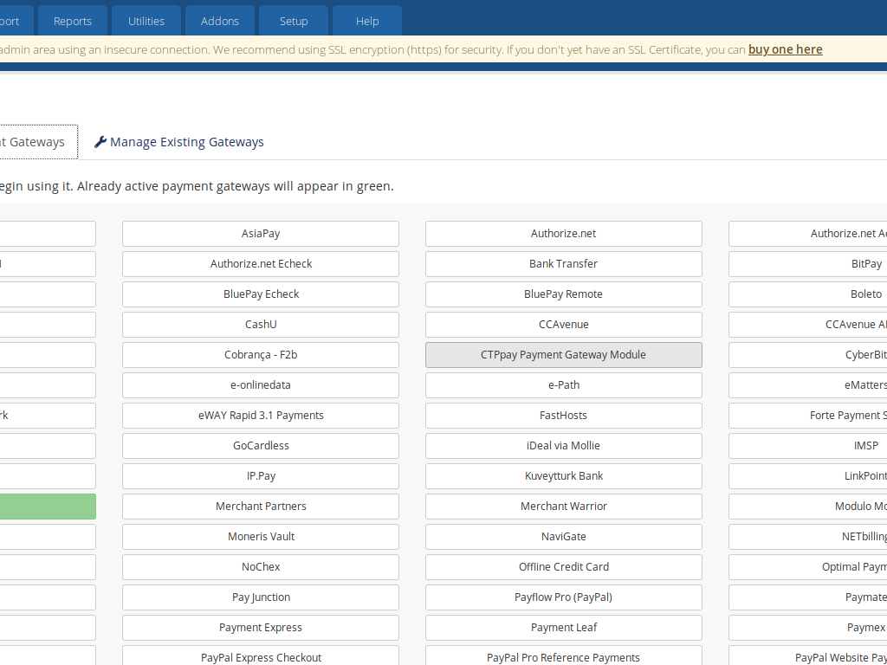
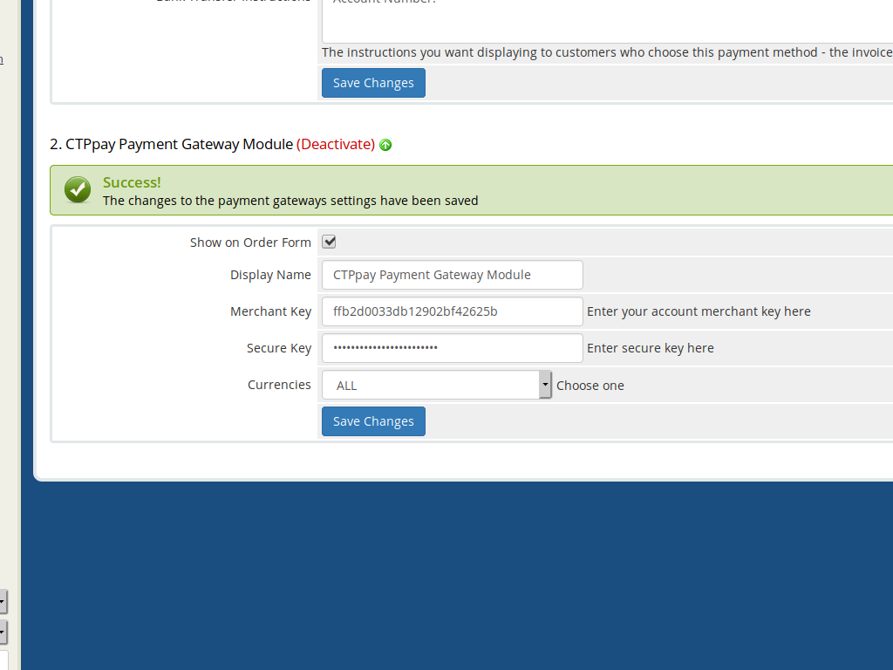

# WHMCS CTPpay Payment Gateway Module #

## Minimum Requirements ##

For the latest WHMCS minimum system requirements, please refer to
https://docs.whmcs.com/System_Requirements

## Installation & Activation

1. To install the the module, upload `modules/gateways/ctppay.php` to the
   `/modules/gateways/` folder of your WHMCS installation.
   
   The callback file `modules/gateways/callback/ctppay.php` should be uploaded to the
   `/modules/gateways/callback/` folder of your WHMCS installation.

2. Navigate to `Setup > Payment Gateways` to activate and configure the new module. Click
   here:

3. Enter your merchant key and the secure key from CTPpay. Cleck the "Save Changes" button:

Congratulations!
